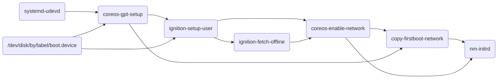

```mermaid
flowchart LR
    S(systemd-udevd) --> A(coreos-gpt-setup)
    D(/dev/disk/by/label/boot.device) --> A
    I(ignition-setup-user)
    C(coreos-enable-network)
    F(copy-firstboot-network)
    O(ignition-fetch-offline)
    N(nm-initrd)

    A--> I --> C --> F
    I --> O
    A --> F
    F --> N
    D --> I
    C --> N
    O --> C
```
